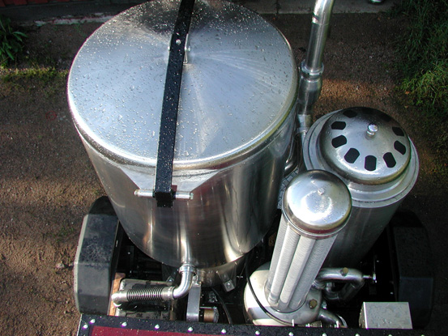

# Gazogène

## Principe

Utilisation des gaz issus de la combustion incomplète de bois comme carburant dans des moteurs à essence.

Développé intensément pendant la 2^ème guerre mondiale pour pallier au manque de carburant, le gazogène est depuis tombé dans l'oubli. Les développements récents sont tournés vers la production d'énergie à partir de biomasse, dans des unités fixes de grande taille (usines). Seuls quelques passionnés ont continué à développer ces systèmes pour les véhicules, et parmi eux, les travaux de M.**Vesa Mikkonen** (site web : https://www.ekomobiili.fi/Tekstit/english_etusivu.htm) nous permettent d'utiliser du bois résineux.

 

## Implémentation

Idéalement, le gazogène est installé sur une remorque tractée par le véhicule.

Les véhicules adaptés à cet usage possèdent des moteurs essence de forte cylindrée, comme les véhicules Américains anciens par exemple.

La carburation doit être adaptée à ce nouveau carburant plus "pauvre" que l'essence, ainsi que le véhicule dans une moindre mesure.

## Difficultés

- obtention de l'introuvable copie du livre de Vesa Mikkonnen permettant de fabriquer un tel gazogène (mail envoyé)
- achat outils de travail de l'acier inox (principalement) :
    - découpeuse à plasma
    - rouleuse de tôle
    - poste à souder Tig AC/DC
- apprentissage soudure Tig sur inox 

NB : Comme pour d'autres projets de ce FABeLABe, il ne s'agit que d'*implémenter la solution* conçue au préalable

??? info "Statut projet"

    === "Priorité"
        * [x] basse
        * [ ] moyenne
        * [ ] importante
        * [ ] élevée

    === "Avancement"
        * [x] en attente
        * [ ] démarré
        * [ ] en cours
        * [ ] terminé
        * [ ] déployé

    === "Conception"
        * [ ] esquisse
        * [ ] avant-projet
        * [ ] projet

    === "Réalisation"
        * [ ] prototype : réalisation & essais
        * [ ] optimisation suite REX
        * [ ] modèle 001
        * [ ] documentation (manuels & plans)

    === "Déploiement"
        * [ ] formation (assistance à réalisation)
        * [ ] réalisation par autrui
