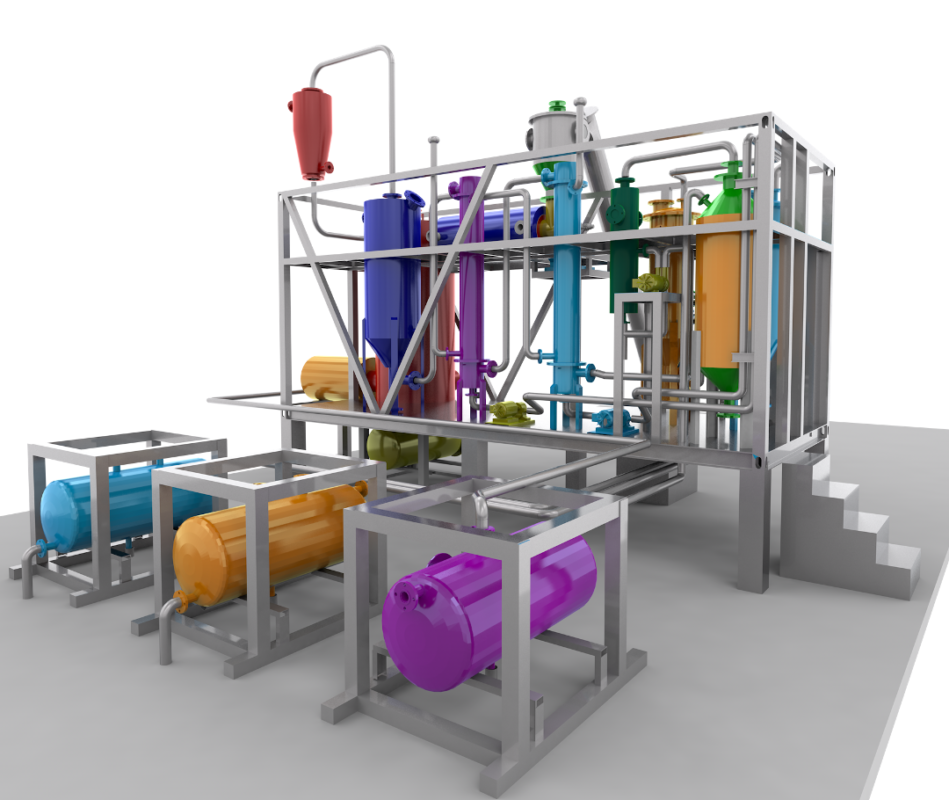

# Plastique --> carburant diesel

## Principes

Les plastiques sont réalisés à partir de pétrole.

La condensation des gaz issus de la pyrolyse (fusion à 400° en l'absence d'oxygène) des plastiques produit en retour du diesel, de l'essence et un gaz combustible réinjectable dans le processus de pyrolyse.

La complexité des process varie comme leur échelle. Nous en sommes à la sélection d'une méthode simple (fabrication par lot) et adaptée à de petites capacités de traitement (100 à 1000 kg/jour).

## Implémentation

Le modèle développé par [Pyrolyse](https://www.pyrolyze.com/150-kg-h-pyrolysis-plant/) semble idéal.

Nous devons l'adapter à nos contraintes.

## Objectifs

* Réduction de la pollution plastique visible (macro-déchets), sur terre et sur mer ...
* Développement d'une petite "économie" mêlant : 
    * la récupération des plastiques (acteurs "informels" comme les ROMS) : paiement au poids
    * la production et le stockage de carburants "proches" des standards pour emploi dans des moteurs "rustiques"
    * l'utilisation de ces carburants dans des projets mettant en valeur l'aspect écologique (dépollution), social (économie informelle) et résilient (valorisation et traitement sur place des déchets). Par exemple :
        * fourniture de carburant pour les bateaux assurant les prestations de visite des Calanques, ou à fin d'emploi dans des machines agricoles, si possible en agriculture biologique ...
        * alimentaton de chaudières au "fioul" pour des habitats collectifs d'associations type emmaus ...
* Export du système de collecte & production (éprouvé par le FABeLABe auparavant) auprès de populations type 1/3 monde ... par formation lors de stages pour l'assistance à la réalisation

## Principales difficultés

* fourniture des déchets plastiques
* entrepôt de tri & stockage tampon des déchets
* atelier de fabrication des machines
* lieu d'essais & d'exploitation du process

NB : Comme pour d'autres projets de ce FABeLABe, il s'agit d'*implémenter une solution* conçue au préalable *en l'adaptant à nos contraintes* & capacités de réalisation.

??? info "Statut projet"

    === "Priorité"
        * [ ] basse
        * [ ] moyenne
        * [ ] importante
        * [x] élevée

    === "Avancement"
        * [x] en attente
        * [ ] démarré
        * [ ] en cours
        * [ ] terminé
        * [ ] déployé

    === "Conception"
        * [ ] esquisse
        * [ ] avant-projet
        * [ ] projet

    === "Réalisation"
        * [ ] prototype : réalisation & essais
        * [ ] optimisation suite REX
        * [ ] modèle 001
        * [ ] documentation (manuels & plans)

    === "Déploiement"
        * [ ] formation (assistance à réalisation)
        * [ ] réalisation par autrui